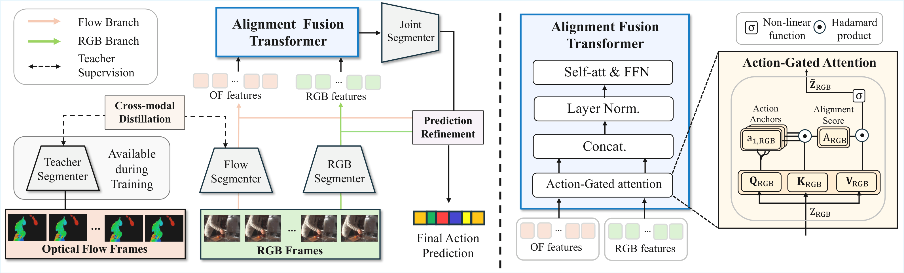

# RELATE

This repos contains code for training RGB-based action segmentation task from our work "Distill, Suppress, and Fuse: Cross-Modal Knowledge Integration for Optical Flow-Free Temporal Action Segmentation" (ICMLW 2026). Please see our paper for more detailed information.



## Installation

```bash
git clone https://github.com/Hsj303/RELATE
cd RELATE
pip install -r requirements.txt
```

Requires Python 3.9+ and PyTorch 2.x. A GPU is recommended for training
but not required to run the tests.

## Data preparation

RELATE is evaluated on GTEA, 50Salads, and Breakfast, using
2048-d I3D features (1024-d RGB + 1024-d optical flow) laid out as:

```
data/<dataset>/features/<video_id>.npy
data/<dataset>/groundTruth/<video_id>
data/<dataset>/mapping.txt
data/<dataset>/splits/train.split<K>.bundle
data/<dataset>/splits/test.split<K>.bundle
```
The datasets can be downloaded in https://github.com/yabufarha/ms-tcn.git 


## Usage

**1. Pretrain the optical-flow teacher** (`RefSegmenter`) on optical-flow
I3D features only, with a plain segmentation loss. Any standard MS-TCN /
ASFormer training loop works with RELATE. Save its checkpoint as `<ckpt>.pt`.

**2. (Optional) Pretrain the modality bridge**, if you want the flow branch
to receive bridged RGB->OF features instead of raw RGB (Sec. 3.1):

```python
from relate.modality_bridge import ModalityBridge, train_modality_bridge
from relate.data import BatchGenerator

bridge = ModalityBridge(dim=1024)
batch_gen = BatchGenerator(num_classes, actions_dict, gt_path, features_path, sample_rate)
batch_gen.read_data(train_list_file)
train_modality_bridge(bridge, batch_gen, device="cuda:0", save_dir="./runs/gtea/bridge")
```

**3. Train RELATE:**

```bash
python scripts/train.py \
    --data-root ./data --dataset gtea --split 1 \
    --backbone MS-TCN --fusion afti --distill kd \
    --teacher-ckpt ./runs/gtea/teacher/epoch-120.pt \
    --output-dir ./runs/gtea/split_1 \
    --epochs 100 --lr 0.001 --gamma 0.5
```


**4. Run RGB-only inference**

```bash
python scripts/predict.py \
    --data-root ./data --dataset gtea --split 1 \
    --checkpoint-dir ./runs/gtea/split_1 --epoch 100 \
    --output-dir ./runs/gtea/split_1/predictions
```

Add `--no-refine` to disable the Sec. 3.4 prediction refinement step.

**5. Evaluate:**

```bash
python scripts/evaluate.py \
    --data-root ./data --dataset gtea --split 1 \
    --pred-dir ./runs/gtea/split_1/predictions
```

## Citation

```
@inproceedings{han2026relate,
  title     = {Distill, Suppress, and Fuse: Cross-Modal Knowledge Integration
               for Optical Flow-Free Temporal Action Segmentation},
  author    = {Han, Seungjin and Kim, Gyeong-hyeon and Kim, Eunwoo},
  booktitle = {AdaptFM: Resource-Adaptive Foundation Model Inference
               (ICML 2026 Workshop)},
  year      = {2026}
}
```
## License

MIT — see [LICENSE](LICENSE). The MS-TCN- and ASFormer-derived backbone
components (`relate/backbones.py`, `relate/layers.py`) are adapted from the
respective public, MIT-licensed reference implementations of
Farha & Gall (2019) and Yi et al. (2021).
